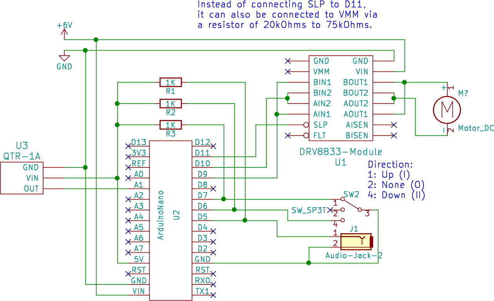
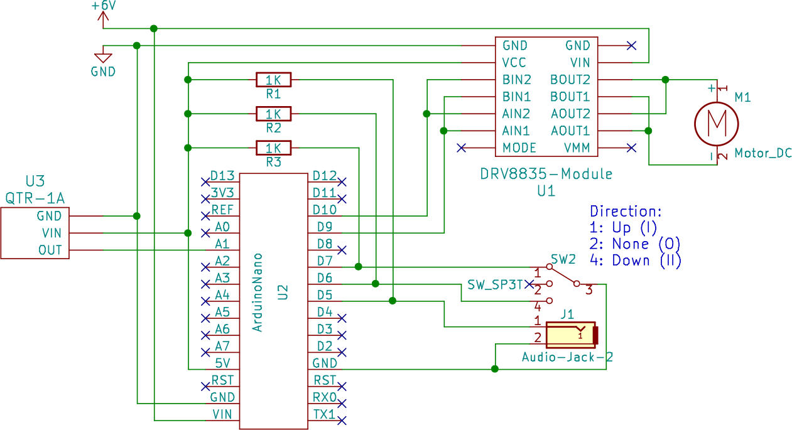
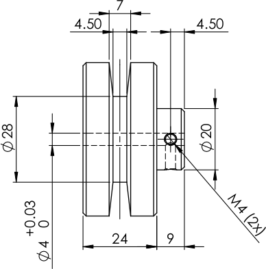
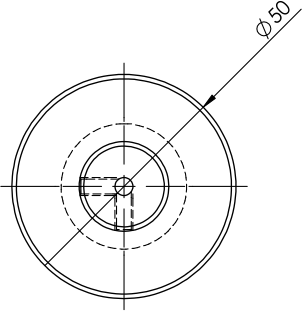
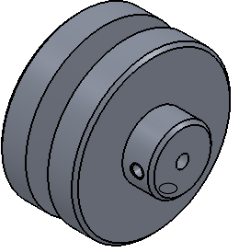

.. Copyright 2018 Heiko Rothkranz
   Licensed under the Apache License, Version 2.0 (the "License");
   you may not use this file except in compliance with the License.
   You may obtain a copy of the License at
   http://www.apache.org/licenses/LICENSE-2.0
   Unless required by applicable law or agreed to in writing, software
   distributed under the License is distributed on an "AS IS" BASIS,
   WITHOUT WARRANTIES OR CONDITIONS OF ANY KIND, either express or implied.
   See the License for the specific language governing permissions and
   limitations under the License.

Hardware building instructions
##############################

Since the various parts required to build the AFRM3 seem to be subject to very
unpredictable availability, this section aims to provide generic information
rather than specific instructions.

.. _section-hardware-schematics:

Schematics
**********

Two different schematics were developed and built: One using the DRV8833 motor
driver, and one for the DRV8835 motor driver. The aim was to maximize the
commonality between them so that the same software can run on both versions with
minor adaptions only.

   
   Schematics for AFRM3 with DRV8833 driver

   
   Schematics for AFRM3 with DRV8835 driver

Parts list
**********

* :ref:`Housing <section-hardware-housing>`
* :ref:`Motor <section-hardware-motor>`
* :ref:`Motor driver <section-hardware-motor-driver>`
* :ref:`Controller <section-hardware-controller>`
* Motor mount
* :ref:`Motor pulley <section-hardware-pulley>`
* :ref:`Position sensor <section-hardware-position-sensor>`
* :ref:`Power supply <section-hardware-power-supply>`
* Power cord
* Direction switch
* Audio jack
* Wiring
* Pull-up resistors
* Mounting plate for electronics
* Box for electronics
* Nuts, bolts and fasteners

.. _section-hardware-housing:

Housing
*******

The housing serves several functions:

* Protect people from the machine: It shouldn't be possible e.g. to stick
  fingers inside when the housing is closed.
* Protect the machine from the elements: This is especially if it will be
  mounted outdoors. The slot opening on top is unavoidable, but maybe you can
  attach a cover that can be closed when the rope is not mounted.
* Provide fixation for the motor and pulley: Either the housing needs to be
  mounted to another structure, or it needs to be heavier than what the motor
  can pull (to prevent the AFRM3 from pulling itself up the flag pole when the
  flag becomes stuck; see the :ref:`Motor <section-hardware-motor>` section).

A suggestion for a heavy enclosure is the IP65 wall box from RS Components
(https://sg.rs-online.com/web/p/wall-boxes/7467346). Lighter plastic enclosures
that are easier to modify may be found in the enclosure shop next to the
escalator at Sim Lim Tower, 3rd floor.

.. _section-hardware-motor:

Motor
*****

This design uses brushed DC motors, although brushless DC motors or stepper
motors should also be possible with an appropriate motor driver and slight
modification of the software.

For brushed DC motors there is an inverse proportional relationship between
speed and torque: The maximum torque is reached at standstill and the maximum
speed occurs when there is no load. Therefore, the motor selection needs to take
both values into account. The maximum torque (="stall torque") is usually given
in Nm. The maximum speed is usually given in rotations per minute (RPM). None of
the motors we tested reached their specified maximum torque, with some being
substantially weaker than advertised.

The desired RPM during operation can be calculated from the length of the flag
pole, the diameter of the pulley where the rope is and the duration of the
national anthem in minutes:

:math:`{RPM}_\mathrm{desired}= \frac{l_\mathrm{pole}}{d_\mathrm{pulley} \cdot \pi \cdot t_\mathrm{anthem}}`

The minimum required motor torque in kgcm can be calculated from the maximum
force required to move the flag in kgf and the radius of the pulley where the
rope is in cm:

:math:`T_\mathrm{min} = F \cdot r`

Due to the inverse proportional relationship between torque and speed, the
maximum torque and speed of the motor must both both be chosen higher than these
desired values. In theory, this means that if your calculated minimum torque is
30% of the motor's stall torque, your desired speed cannot be higher than 70% of
the motor's maximum speed. In reality, most motors appear to be weaker than
advertised, so it seems safer to choose a significantly stronger motor.

However, since the motor is controlled by PWM in this design, it means that at
low speed, the power supply to the motor will be off for longer than it is on
(PWM <50%). At some point, the power supply will not be on long enough for the
motor to move, i.e. there is a minimum speed below which the motor will just
stall. For a strong motor, this lowest speed may be so high that the flag will
reach the end of the pole too fast. Potentially, a large capacitor in parallel
to the motor can flatten the PWM supply sufficiently to reduce the minimum motor
speed, but we didn't test this. Generally, it seems advisable to choose a motor
with a significantly higher torque than required, but to operate it relatively
near its maximum speed.

We finally chose a 6V brushed DC motor with 133rpm max and a stall torque of
8.8kgcm (https://www.robot-r-us.com/motor-brushed/gear-motor-6v-133rpm-751-gear-ratio.html).

.. _section-hardware-motor-driver:

Motor driver
************

The motor driver controls the power to the motor based on the control signals of
the controller. Most motor drivers for brushed DC motors are basically switches:
They controller provides a PWM signal to the driver, and the driver switches the
motor power on whenever the PWM signal is high and off whenever it is low.

For our application, it is important that the motor driver can sustain the stall
current of the motor for several seconds. The peak current given in motor driver
specifications can often be delivered for a few milliseconds before the driver
shuts down or becomes damaged. Many dual channel motor drivers allow to connect
both channels in parallel for twice the current (see the :ref:`schematics
<section-hardware-schematics>` above). If this is still insufficient, several
motor driver boards can often be operated in parallel as well.

Motor drivers have an internal resistance when switched on. This results in a
voltage drop proportional to the current. This means that especially at motor
stall, when the highest current is drawn, the voltage supplied to the motor may
drop significantly and therefore the motor stall torque can be significantly
reduced. The cheap and widely available L298N motor driver has an especially
high internal resistance and therefore is not suitable for the AFRM3. Drivers
with relatively low internal resistance include the Toshiba TB6612FNG, the
DRV8833 and DRV8835 from TI and the VNH5019 from ST. Always check the datasheet
for "MOSFET ON-Resistance" or "high side/low side resistance" before buying.

Furthermore, the motor drivers need to allow to drive the motor in both
directions, but this is the case for all the above-mentioned ones. Motor control
is usually done by a combination of PWM and direction signals and is different
from driver to driver. It should be relatively simple to adapt the schematics
and :ref:`software <section-software-motor-drivers>` to other drivers, however.

Due to limited availability, we finally chose two different motor drivers,
providing peak currents of 3-4A using both channels in parallel:

* DRV8833: https://www.robot-r-us.com/motor-driver/drv8833-dual-motor-driver-carrier.html
* DRV8835: https://www.robot-r-us.com/motor-driver/drv8835-dual-motor-driver-carrier.html

This seemed to be sufficient, because our motors had a lower stall current (and
torque) than advertised. The two drivers have different pinouts, but can be
controlled the same way and thus do not require software modification.

.. _section-hardware-controller:

Controller
**********

The controller reads input signals from the direction switch, push button and
position sensor and controls the motor in response. Both the Arduino Nano and
Arduino Micro provide a sufficient number of input and output pins. We chose an
Arduino Nano for cost and size reasons.

We noticed that the Arduino's internal pull-up resistors did not work reliably
with our direction switches, audio jacks and push buttons. Sometimes, an input
change would go undetected. Therefore we added the additional pull-up resistors
as shown in the :ref:`schematics <section-hardware-schematics>`.

.. _section-hardware-pulley:

Motor pulley
************

The motor pulley is the interface between the motor and the flag rope. The
dimensions shown below may have to be adapted to the rope. It is important that
the pulley has a good grip on the rope, so that the rope doesn't slip when
stalling at the end of the pole.

.. _section-hardware-position-sensor:

Position sensor
***************

The controller needs to know the flag position in order to detect when the rope
is stalled, and to provide speed control in order to match flag position to
progress through the anthem.

Provided that the rope does not slip through the pulley, flag position can be
infered from pulley rotations. We evaluated two means of determining pulley
rotations:

* Motor encoder: Some motors include a magnetic rotary encoder. The number of
  motor rotations can be calculated by counting the number of encoder pulses.
  Usually, direction can also be inferred from the sequence in which the pulses
  occur. However, the encoder resolution per actual rotation is usually far too
  high, causing the rather slow Arduino controller to miss steps or to be
  overloaded when filtering encoder noise.
* Optical sensor: We fixed two strips of black adhesive tape onto the backside
  of the pulley, roughly dividing the backside into two black and two silver
  quarters. A reflectance sensor mounted on the motor attachment measures the
  reflectance of the pulley's back side. Compared with the motor encoder
  solution above, this results in a much more manageable 4 counts per pulley
  rotation. We used this reflectance sensor, providing an analog output:
  https://www.robot-r-us.com/sensor-infrared/qtr-1a-reflectance-sensor-2-pack.html
  
  .. figure:: _static/pulley-tape.jpg
     :scale: 15%
     :align: center
     
     Adhesive tape on the backside of the pulley
  
  .. figure:: _static/reflectance_sensor.jpg
     :scale: 12%
     :align: center
     
     Reflectance sensor mounted onto the motor bracket

.. _section-hardware-power-supply:

Power supply
************

.. danger::
   Always unplug the power supply from mains before opening the housing! There
   is a real risk of electrical shock from unisolated contacts and of injury due
   to moving parts!

The power supply needs to provide sufficient voltage and current to the motor
and the controller. The power consumption of the controller is negligible, but
as for the motor driver, the power supply should be able to provide the motor
stall current for at least several seconds. A comfortable margin may result in
improved longevity.

We used a 6V motor, but 6V power supplies with sufficient current output were
hard to find. Instead, we used a 5V/4A power supply from Kaichin Computer
Systems, Sim Lim Tower #03-07, which had a calibration screw to adjust its
output voltage. With this, we could raise the output voltage to about 5.5-6V,
which was sufficient for our combination of parts.

The VIN supply port of the Arduino Nano is specified to need at least 7V in
order to operate reliably, but we did not have any problem with lower voltage.

.. important::
   When running a mains cable into the housing, make sure to connect the ground
   wire to the ground pin of the power supply as well as to the housing and/or
   mounting plate of the AFRM3 (if it is metallic)! This will help to blow the
   fuse in case mains power reaches the housing due to failure or accident.

