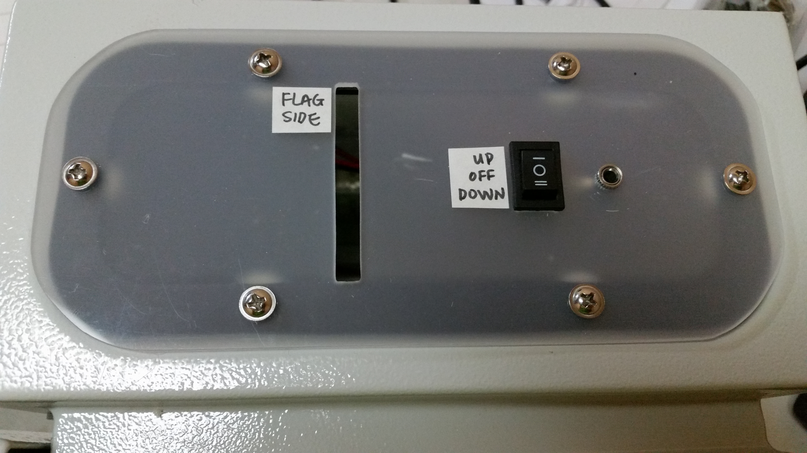

.. Copyright 2018 Heiko Rothkranz
   Licensed under the Apache License, Version 2.0 (the "License");
   you may not use this file except in compliance with the License.
   You may obtain a copy of the License at
   http://www.apache.org/licenses/LICENSE-2.0
   Unless required by applicable law or agreed to in writing, software
   distributed under the License is distributed on an "AS IS" BASIS,
   WITHOUT WARRANTIES OR CONDITIONS OF ANY KIND, either express or implied.
   See the License for the specific language governing permissions and
   limitations under the License.

User's Manual
#############

Overview
********

   
   View from the top

.. figure:: _static/view-inside.png
   
   View of the inside of the AFRM3 (doors and covers removed)

Mechanical installation
***********************

.. _section-user-calibration:

Calibration
***********

Before the first use, the AFRM3 has to be calibrated. This enables the device to
automatically control the motor speed so that the flag will reach the end of the
pole roughly in time with the end of the national anthem.

The AFRM3 stores its calibration values in flash memory and thus will remember
them even when unpowered for a long time. It is only necessary to re-run the
calibration when the motor speed becomes too far off the ideal speed, e.g. due
to a different tension of the rope (also see note below).

In calibration mode, the flag is moved all the way up and down and the time and
distance is measured by the controller. From these values, the controller
calculates the optimum speed so that the flag will travel the length of the pole
within the duration of the anthem.

.. note::
   Depending on the length of the flag pole, tension and friction of the rope,
   the motor may not be able to move the flag slowly enough to match the
   duration of the anthem. This is because the motor has to run at a certain
   minimum power to avoid becoming stuck inadvertently. If this is the case,
   try tightening the rope slightly, to increase the load on the motor and make
   it run slower. This can be tricky, though, and success cannot be guaranteed.

If the AFRM3 has never been calibrated before, it will enter calibration mode
automatically. In this case, you can (but don't have to) skip step 2 and 3 below.

#. Move the flag manually to the lowest position
#. Make sure the direction switch is in the OFF position.
#. Bring the controller into calibration mode by holding down the pushbutton
   while turning the power on, and releasing it after ~10 seconds.
#. With the flag in the lowest position, switch the direction switch to UP to
   start the calibration in the upward direction.
#. Let the flag run upwards until it is blocked at the top of the pole. Make
   sure that the motor automatically stops running at most a few seconds later.
   If the motor does not stop running, increase the rope tension and restart the
   calibration again from step 1.
#. Switch the direction switch to DOWN to start the calibration in the downward
   direction.
#. Again, let the flag run all the way down until it is blocked at the bottom
   and the motor stops automatically at most a few seconds later. If it doesn't,
   increase the rope tension and restart the calibration from step 1.
#. Set the direction switch back to OFF and turn off the power. The device
   is now calibrated and will use the new values the next time it is powered up.

Regular operation
*****************

#. Turn on the power for the AFRM3
#. Plug in the push button
#. Set the direction switch to the desired direction (UP/DOWN)
#. Hold down the push button to run the motor
#. The motor will stop when the push button is let go or when the flag reaches
   it's end position
#. At the end of operation, set the direction switch back to OFF, unplug the
   push button and turn off the power

The AFRM3 will automatically adjust the speed in order to roughly match the
duration of the national anthem (90 seconds). This means the speed may
automatically decrease or increase during operation. If the speed is repeatedly
too far off, try rerunning the :ref:`calibration <section-user-calibration>`.
However, the motor will maintain a minimum power in order to operate reliably
and this may result in the speed being too high. This is especially likely on
short flag poles and with insufficient rope tension.

If the load is too high (i.e. due to flag too heavy, too much drag, rope tension
too high), the machine may stall. In this case, it will briefly try to apply
more power to the motor in an attempt to become unstuck. If this is not
successful, it will assume that the flag reached the end of the flag pole and
stop the motor. If this happens before the end of the pole has been reached, try
re-running the :ref:`calibration <section-user-calibration>` and/or loosening
the rope tension.

Mounting and unmounting the rope
***********************************

.. danger::
   Always unplug the power cord from mains before opening the housing! There
   is a real risk of electrical shock from unisolated contacts and of injury due
   to moving parts!

The rope can be easily mounted and unmounted, to allow to move the flag by hand
and to cover the box for protection from the elements. To mount the rope, open
the box, and put the rope through the slot in the top plate. The flag should be
on the side marked "flag side".

The AFRM3 detects when the flag reaches the upper or lower end of the flag pole
by it becoming stuck there. If the flag does not reliably become stuck at the
top of the pole, you can tie a big knot into the rope that
would become stuck at the AFRM3's slot just before the flag would reach the top.
A knot in the rope below the flag would stop it on its way down.

If the tension of the rope is too low, the rope might slip through the pulley,
especially when it is blocked at the end positions. If the rope slips, the speed
control and the automatic stopping at end position will be unreliable, so the
rope needs to be tight enough to prevent this. However, if the tension is too
high, the friction will be higher, too, and therefore the motor might not have
enough power to move the flag. Adjust the rope tension accordingly.

